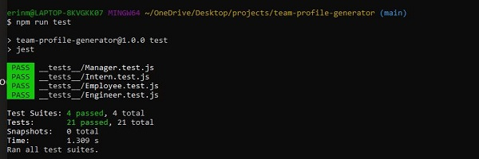

# Team Profile Generator - Challenge #10
  
## Description:
This is a command line application that allows for a user to enter team information via command line prompts.  This information is then used to create an HTML page.  I primarily utilized my developing skill sets in javascript and node.js create this application.  Some of the methods and skills I used are noted below:

* The npm inquirer was utilized for command line prompts; please refer to the index.js file.
* Classes and constructor methods were created for each employee object; please refer to the lib folder.
* Jest was utilized as a testing framework as TDD (Test-driven Development) was utilzied during the creation of each class; please refer to the __tests__ folder.

* Please click the link below to see a demonstration of how this application works:
 
    [Application Demo Video](https://watch.screencastify.com/v/0wrJsXcsGVSCfGgeXSWS)

## Questions:
Please do not hesitate to reach out to me directly with additional questions via my email address or Github Profile below:
  
* Email: [erin.michon@gmail.com](mailto:erin.michon@gmail.com) 
* Github Profile: [erin-michon](https://github.com/erin-michon)